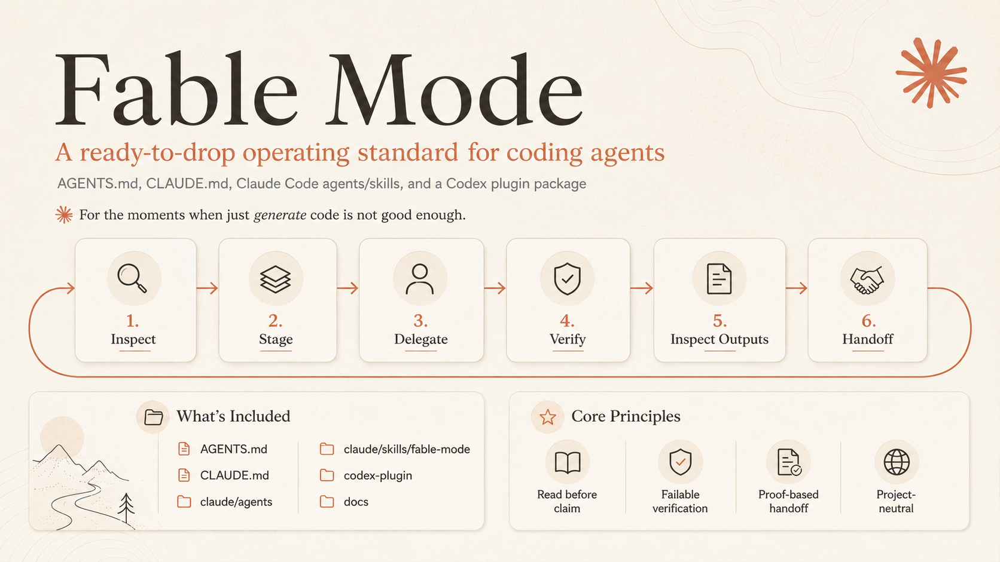

# Fable Mode



> Until the government figures things out, this will have to do.

An operating standard for coding agents: disciplined workflows that read the real codebase, verify with checkable steps, and hand off with clear facts.

## Core Principles

**Relentless Resourcefulness** — the goal is the result, not the attempt. Three genuinely different approaches before saying "blocked." A locked door is a routing problem, not a stop sign.

**Verification Discipline** — done = proven, not plausible. Build passes → tests pass → it actually runs → the live result is checked. Every bug gets a regression test before the fix.

**Finish the Loop** — never end on a plan, a promise, or a question you could answer yourself. If the last thing you wrote is future tense, you're not done.

**Judgment & Taste** — one recommendation with reasoning, never a menu. Show the rejected alternative. Flag the blind spot. Give a confidence level.

**Communication Clarity** — lead with the outcome. Complete sentences, not fragment chains. Define terms. Everything the reader needs lands in the final message.

**Memory** — write durable facts down the moment you learn them. On long tasks, keep a ledger and re-read it instead of trusting recall.

## What it is

Fable Mode is a set of conventions for Claude Code, Codex, Cursor, and other agents to:

- Inspect the real system before editing
- Break complex work into staged steps
- Verify claims with checks that can fail
- Separate what's confirmed from what's unknown
- Delegate only when work is independent

It's not a model jailbreak or capability hack—it's public process discipline that improves consistency and catches mistakes early.

## What's included

```
.
├── CLAUDE.md              # Claude Code operating guide (drop into your project root)
├── AGENTS.md              # Generic agent standard (drop into your project root)
├── templates/drop-in/     # Clean copies of CLAUDE.md and AGENTS.md for new projects
├── claude/                # Claude Code agents, commands, and skills
├── codex-plugin/          # Codex plugin package
├── docs/                  # Installation, customization, verification guides
├── bin/                   # Validation and packaging helpers
└── README.md              # This file
```

## Quick start

1. Copy `CLAUDE.md` and `AGENTS.md` into your project root:

```bash
cp templates/drop-in/CLAUDE.md /path/to/your/repo/CLAUDE.md
cp templates/drop-in/AGENTS.md /path/to/your/repo/AGENTS.md
```

2. Customize the project identity section at the end of each file with your stack, commands, and source-of-truth paths.

3. Ask Claude Code:

```text
Use Fable Mode for this task. Inspect first, create a stage map, verify with checks that can fail, and hand off with verified vs unverified separated.
```

## Core idea in one screen

```
Map before touching.
Diagnose from real artifacts.
Decompose only where it creates leverage.
Delegate with a return schema and anti-fabrication rule.
Verify with checks that can fail.
Inspect rendered/generated outputs before declaring them done.
Confirm before irreversible, outward-facing, production, money, auth, data-loss, or legal actions.
Separate proven facts from assumptions.
Leave the repo easier to resume.
```

## Why this exists

Coding agents fail in predictable ways:

- They guess paths instead of reading the actual structure
- They skip nearby tests and examples
- They treat generated text as truth
- They trust subagents without verification
- They call typecheck "end-to-end"
- They hide unverified work in final handoffs

Fable Mode makes these failures visible and correctable.

## Using with your agent

### Claude Code

Install into a repo:

```bash
cd claude && node bin/install.mjs --target /path/to/your/repo
```

Then ask Claude Code to use the `fable-systems-engineer` agent or type `/fable-mode` for the slash command.

### Codex

Install the plugin:

```bash
cd codex-plugin && node install-local.mjs --target /path/to/your/repo
```

Ask Codex: `Use fable-mode for this task.`

### Any agent

Just copy `AGENTS.md` and `CLAUDE.md` into your existing AGENTS.md and CLAUDE.md files found in .claude or .codex folders, or replace them entirely. 

## Example handoff

```md
Implemented: Added validation to the import endpoint and surfaced structured errors in the UI.

Changed files:
- src/api/import.ts — added Zod boundary validation and typed error response
- src/components/ImportPanel.tsx — rendered validation messages and disabled submit while pending

Verification:
- npm run typecheck — pass — no TS errors
- npm run test -- import — pass — 8 focused tests passed
- Manual UI check at 375px and 1280px — pass — validation errors render without overflow

Not verified:
- Full production import with provider credentials — blocked; credentials not available locally

Remaining risk:
- Large CSV performance should be profiled with a production-like file

Next action:
- Run staging import against a large fixture before release
```

## Reference

- `docs/installation.md` — detailed setup steps
- `docs/customization.md` — how to tailor Fable Mode to your project
- `docs/verification.md` — what to check before shipping
- `docs/design-notes.md` — philosophy and tradeoffs
